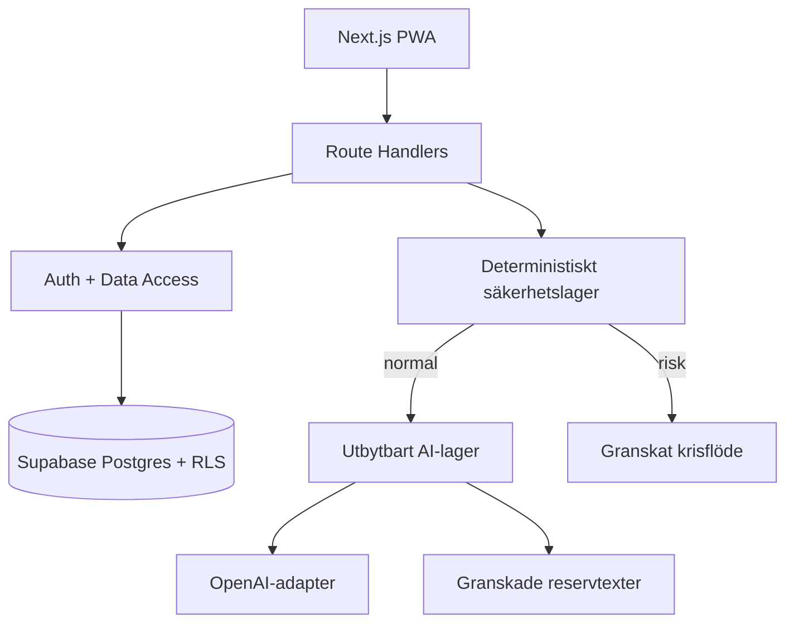

# Teknisk arkitektur

## Överblick

Klienten får aldrig hemliga nycklar eller systemprompt. Route Handlers validerar input, verifierar användare/roll, rate-limit:ar och returnerar minsta nödvändiga DTO. PostgreSQL/RLS är sista dataförsvar även om ett routefel skulle uppstå.

## Lager

| Lager | Plats | Ansvar |
|---|---|---|
| Presentation | `src/app`, `src/components` | Routing, tillgänglig UI, responsivitet |
| API/BFF | `src/app/api` | Validering, auth, orkestrering, DTO |
| Domän | `src/lib/ai`, `safety`, `validation` | Ritualregler, prompts, säkerhet, fallback |
| DAL/Auth | `src/lib/auth`, `supabase` | Session, roll, klienter, datagräns |
| Data | `supabase/migrations` | Relationer, index, RLS, retention |
| Drift | Vercel + Supabase | Miljöer, logg, backup, schemalagda jobb |

## Viktiga dataflöden

### Ritual

1. Klienten skickar mood, frivillig note, ton, längd, områden, eventuellt mål och högst fem korta nyliga meddelanden.
2. Zod avvisar överstora eller ogiltiga fält.
3. Servern verifierar användaren och förbrukar en databasbaserad dagskvot.
4. Deterministisk säkerhetsklassificering körs före AI.
5. Vid risk returneras granskat svar och resurser; vanlig AI bypassas.
6. Annars används OpenAI-adaptern eller reservtext.
7. Utdata valideras mot längd, diagnos, falsk säkerhet och beroendespråk.
8. Check-in, ritual, meddelande och tokenmetadata sparas under användarens RLS.
9. Klienten markerar kvällen färdig och visar inget nästa innehåll.

### AI-chatt

Högst sex tidigare meddelanden hämtas och åtta användarturer tillåts i klienten. Råtext är markerad för 30 dagars standardgallring. Ingen chatttext omvandlas automatiskt till mål eller permanent minne.

### Adminmoderering

`/admin` gör en serverkontroll av moderator/admin. Beslut uppdaterar bidrag, publicerar godkänd text och skapar auditlogg. RLS upprepar rollkontrollen i databasen.

## API-yta

| Metod | Route | Skydd | Funktion |
|---|---|---|---|
| GET | `/api/health` | Publik, inga hemligheter | Integrationsstatus |
| POST | `/api/onboarding` | Inloggad | Profil, preferenser, samtycke |
| POST | `/api/rituals/generate` | Inloggad + rate limit | Säker ritualgenerering |
| POST | `/api/chat` | Inloggad + rate limit | Begränsad reflektionschatt |
| GET/POST | `/api/goals` | Inloggad | Mål |
| PATCH | `/api/goals/[goalId]/steps/[stepId]` | Inloggad + ägarskap | Delsteg |
| POST | `/api/feedback` | Inloggad | Hjälpsamhetsbetyg |
| POST | `/api/community` | Inloggad + rate limit | Modereringskö |
| GET | `/api/library` | Inloggad | Kuraterat publicerat innehåll |
| GET/POST/DELETE | `/api/saved` | Inloggad + ägarskap | Favoriter |
| POST | `/api/reports` | Inloggad + rate limit | Rapport + modereringsärende |
| PATCH | `/api/admin/moderation/[id]` | Moderator/admin | Beslut + audit |
| PATCH | `/api/settings` | Inloggad | Preferenser |
| GET | `/api/account/export` | Inloggad | JSON-export |
| DELETE | `/api/account/history` | Inloggad + fras | Historikradering |
| DELETE | `/api/account/delete` | Inloggad + fras | Kontoradering |
| POST | `/api/ads/*` | Inloggad | Icke-personliga event |
| POST | `/api/billing/checkout` | Inloggad | Adapterstub, avstängd |

## Databas

Migreringarna innehåller samtliga efterfrågade datatyper plus `user_roles`, `user_achievements`, `professional_messages`, `feature_flags` och `rate_limits`. FK med `ON DELETE CASCADE` gör kontoradering heltäckande. Index följer användar-/tidsfrågor, köer och aktiva annonser. Serverägda triggers uppdaterar streak och milstolpar när ritualer eller målsteg slutförs; klienten har bara läsrätt till dessa belöningar.

Känsliga fält:

- `check_ins.note`
- `ai_conversation_messages.content`
- målets privata anteckningar
- safety events (kodad, ingen råtext)
- samtyckes- och auditloggar

## Miljöer och drift

- **Development:** lokalt demo eller separat Supabase dev.
- **Preview/Test:** separat Supabase, testnyckel och testmodell/kvot.
- **Production:** EU-region, demo av, schemalagd retention, backup och larm.

Databasmigreringar körs i CI med kontrollerad roll. Webbruntime får inte schemaändringsbehörighet. Service-role-nyckel används endast i få servermoduler och får aldrig loggas eller exponeras.

## Framtida mobilapp

Domän, validering, databas och API är separerade från React-komponenterna. En native-klient kan återanvända samma API-kontrakt. PWA är första klient för att validera ritualen innan kostnaden för dubbla klienter tas.
